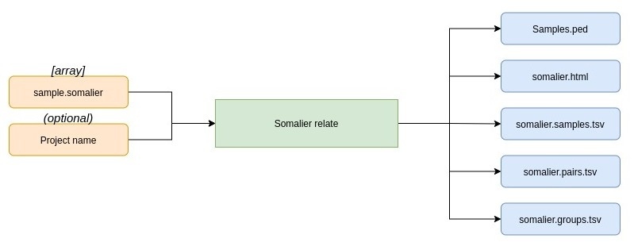

# eggd_somalier_relate

## What does this app do?
This app runs Somalier (v0.2.15) to predict sex of samples. This app measures relatedness of samples and contains other QC metrics such as depth, het and hom of X chromosomes which enables us to predict sex of samples.

This app is based on https://github.com/brentp/somalier

## What are the inputs?
* Array of {sample}.somalier files. These are the output files from somalier extract.
* A string for project folder which will be the output file prefixes, default is somalier prefix (Optional).

## What are the outputs?

* Somalier.samples.tsv - contains depth, het and hom of X chromosomes along with predicted sex and other QC metrics.

* Somalier.html - interactive visualization of results.

* Somalier.pairs.tsv - the relatedness metrics between pairs of samples.
  
* Somalier.groups.tsv - samples grouped together based on relatedness.

## Where is this app applicable?
This app can be used after sites required are extracted, usually after running somalier_extract. This app can be used in a multi sample workflow as the app can take multiple inputs in.
As the predicted sex of samples are not appended to this file, egg_somalier_relate2multiqc is run to 

## How does this app calculate sex of sample?

The {samples}.somalier file is a binary file with selected sites from vcf. The sites on the X and Y chromosome are specific to each chromosome and not in PARs. The heterozygous(het) calls on the X chromosome are used to predict whether a sample is female or male as females have more het calls due to have two X chromosomes. Males typically have 0 or 1 het calls whereas female have a wider range, the threshold for this depends on the assay samples were run on.

### This app was made by EMEE GLH
